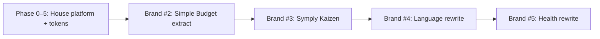
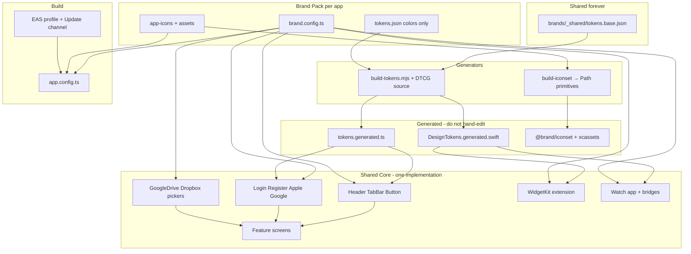
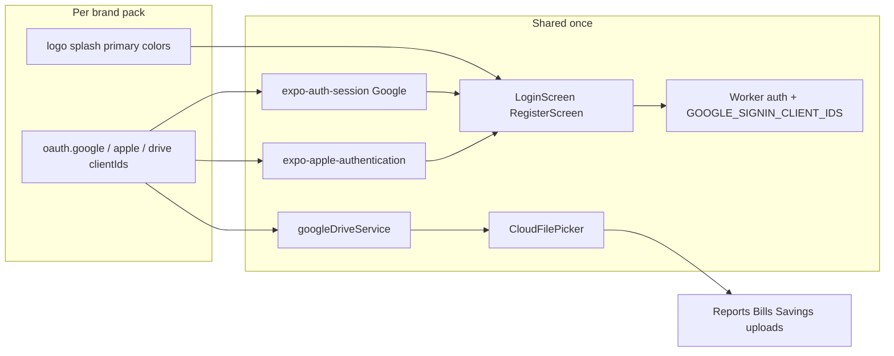
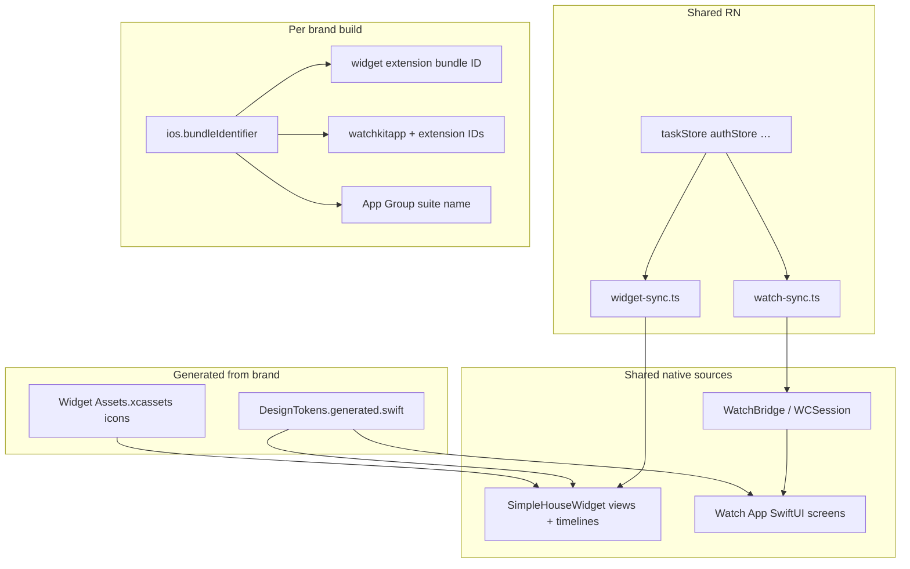
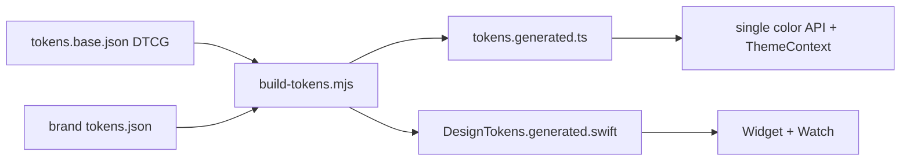

# Unified Brand Tokenization for a Multi-App Ecosystem

> **Status**: Plan v2.6 (Jul 2026) — platform + fleet + Shared User/Smart Engine + **Kaizen donor corrections** (token engine, theming, prebuild); informed by [WHITELABEL_TEMPLATE.md](./WHITELABEL_TEMPLATE.md) · research: [Shared_User_Smart_Engine_Research.md](./Shared_User_Smart_Engine_Research.md) · Symply Kaizen: `symply-kaizen/design/WHITELABEL_TEMPLATE.md`  
> **Goal**: One SimpleHouse codebase → ~10 Simple ✦ apps that share **architecture, screens (including login/onboarding), auth providers, cloud integrations, iOS Widget, Apple Watch companion, fonts, spacing, and components** — and differ only in colors, icons, backgrounds, tab chrome, store identity, feature modules enabled by brand, and per-app OAuth / extension IDs.

Related: [DesignSystem.md](./DesignSystem.md) · [NEW_BRAND_CHECKLIST.md](./NEW_BRAND_CHECKLIST.md) · [WHITELABEL_TEMPLATE.md](./WHITELABEL_TEMPLATE.md) · [Shared_User_Smart_Engine_Research.md](./Shared_User_Smart_Engine_Research.md) · [WATCH_SETUP_GUIDE.md](../watch/WATCH_SETUP_GUIDE.md)

---

## Summary

A brand is **data, not code**. Screens never mention hex or brand glyphs — they use `colors.primary`, `<Icon name="…">`, `Spacing.base`. Swapping apps = swapping the token/icon source. The same tokens must reach **every runtime** (React Native, **iOS Widget**, **Apple Watch**) so nothing drifts.

**Shared product surface (not just chrome):** Login / Register / onboarding, Sign in with **Google** and **Apple**, Google Drive (and other cloud pickers), **WidgetKit extension**, **Watch app + sync bridges**, API client, stores, and shell are **one implementation**. Domain screens live as **feature modules** selected by `brand.tabs` / feature flags. Brands supply visual identity + store/extension IDs + OAuth client IDs — they do not fork auth flows or native companion UX.

**Chosen model:** one Expo codebase + `brands/` packs + dynamic `app.config.ts` + EAS profiles/channels. Not forks, not a monorepo (escape hatch only if features diverge), not runtime multi-tenant theming in one store binary.

**Platform baseline:** Expo SDK **57** (`~57.0.4`) / React Native **0.86** / React 19.2.x. New Architecture is already on. Do not park on SDK 55 — that would be a downgrade from current latest. SimpleHouse today may still be on SDK 54 until Phase 3.

---

## Platform decision (locked)

| Decision | Choice | Why |
|---|---|---|
| **Platform repo** | **Symply Ecosystem** ([`symply-ecosystem`](https://github.com/Androkzn/symply-ecosystem)) | Mature product (~489 commits, ~216 screens), brand scaffolding started (`brands/`, `validate:brand`, `app.config.ts`), production Widget/Watch/backend |
| **Design-system donor** | **Symply Kaizen** (`kaizen.git`) | Proven `design:build` (tokens + icons → RN + Swift `BrandTokens`), Expo 57, coupling audit — **port pipeline + conventions in**, do not switch platform home |
| **Token / theme engines** | **Custom `build-tokens.mjs` + DTCG source**; keep `ThemeContext` / one color API | Kaizen-donor research: Style Dictionary cannot emit gradient + Liquid Glass + per-scheme Swift helpers (SD #895); Unistyles unnecessary when brand is build-time |
| **Prebuild** | **House: `--no-clean`** until Watch/Widget are plugin-owned | Kaizen-donor CNG uses `--clean`; do **not** copy that wipe workflow onto committed `ios/` |
| **Cursor workspace** | Open **SimpleHouse only** | One AI context; “change Google login icon once” = edit shared `src/` |
| **Repo layout** | Do **not** merge all Desktop apps into one mega-folder for day-to-day work | Optional human archive folder is fine; AI and CI stay on the platform repo |
| **Escape hatch** | Monorepo only if products fork screens heavily | Prefer feature modules under one `src/` first |

**Do not** make Symply Kaizen the platform and port House into it. **Do not** open Simple Language + Simple Health + Symply Kaizen + SimpleHouse together expecting cross-app edits — Language/Health are native Swift until rewritten as brands.

---

## Fleet migration order

Existing / planned apps and how they join the ecosystem:

| Order | Product | Today | Path onto platform |
|---|---|---|---|
| **1** | **SimpleHouse** | Expo/RN + Worker (this repo) | **Platform** — finish brand packs + shared auth/companions; **keep only a minimal budget** surface |
| **2** | **Simple Budget** | Lives inside House budget today (~90% of that surface) | **Brand #2** — extract full budget into `src/features/budget/` + `brands/symply-budget/`; House brand keeps a slim subset via feature flags / tabs |
| **3** | **Symply Kaizen** (Simple Kaizen) | Expo/RN sibling | **Brand #3** + port domain screens into `src/features/kaizen/`; steal `design:build` / Expo 57 patterns; archive standalone repo after parity |
| **4** | **Simple Language** | Native **Swift** + Hono | **Rewrite** as RN brand pack; keep old repo as reference; share BE audiences/patterns, not UI |
| **5** | **Simple Health** | Native **Swift** (+ Mac/Watch) + Hono | **Rewrite last** (largest + health-sensitive); only after earlier brands prove Widget/Watch/auth E2E |



### Budget split (House vs Simple Budget)

| Surface | SimpleHouse brand | Simple Budget brand |
|---|---|---|
| Goal | Light household money context only | Full personal/household budgeting product |
| Scope | **~10%** — e.g. summary / quick glance / deep-link out | **~90%** — full budget screens, flows, and advanced tools moved out of House |
| Code | Shared `src/features/budget/` with `brand.features.budget` = `minimal` | Same module with `brand.features.budget` = `full` + Budget-first `brand.tabs` |
| Store listing | Simple House | Simple Budget (own bundle IDs, OAuth, Widget/Watch chrome) |

Rules for the split:
- Do **not** fork budget screens per brand — one feature module, capability gated by brand config.
- Removing 90% from House means House tabs/routes omit advanced budget; deep links may open Simple Budget later if desired (optional, not required for v1).
- Extraction is the first real proof of **feature modules + brand packs** (easier than Symply Kaizen because code already lives here).

**Rules:**
- Cross-cutting UI (Google login icon, AuthShell, tab chrome) changes once in `src/` → all brand builds.
- Per-product look changes only under `brands/<id>/`.
- Domain-only screens are feature modules gated by brand tabs/flags — not separate apps.
- Swift repos stay separate until an intentional RN rewrite; do not merge git histories.

---

## Kaizen donor corrections (locked — Jul 2026)

Cross-check of `symply-kaizen/design/WHITELABEL_TEMPLATE.md` against this plan. Both repos independently chose one codebase + `brands/` + build-time brand — strong validation. Adopt these Symply Kaizen corrections on the **SimpleHouse** platform:

| Topic | Old SimpleHouse lean | **Locked decision** |
|---|---|---|
| Token engine | Migrate to Style Dictionary v5 | **Keep custom `build-tokens.mjs`** (gradients / glass / SwiftUI stops). Adopt **DTCG** (`$value`/`$type`) source format only. Revisit SD only if Android multi-format pain forces it. |
| Theming | Unistyles v3 as preferred v2 | **Keep `ThemeContext` + one color API.** Brand is build-time; only light/dark is runtime. Unistyles = optional later if proven need — not a milestone. |
| Icons | SVG packs via SvgXml | Prefer **compiled `react-native-svg` `<Path>`** from `build-iconset` (avoid re-parse on tint); vectors over 96px raster on native |
| Prebuild | Never `--clean` | **House: keep `--no-clean`** while `ios/` is committed + hand-owned Watch/Widget. Kaizen-donor CNG `--clean` is correct **there** only — do not wipe House `ios/` when porting scripts |
| Env | Mixed `BRAND` / `APP_BRAND` | Canonical: **`APP_BRAND` + `EXPO_PUBLIC_APP_BRAND`** on every EAS profile |
| OAuth secrets | Often literals in env | Prefer **EAS secrets** + `brand.integrations`; inject Google reverse-DNS scheme from `app.config.ts` |
| App Group | Scattered literals | Generate entitlements + Swift `BrandNative.appGroup` from brand (Symply Kaizen: ~7 hardcode sites) |
| Deps | — | `npx expo install` only; hold `gesture-handler@~2.32`; ❌ `@bacons/apple-targets` if it fights existing targets; wrap `@expo/ui` |

### Coupling debt to clear on House (Phase 1 checklist)

Mirror Kaizen-donor measured audit — inventory and fix on this repo:

1. Dual color-access APIs (`useAppColors` vs `useTheme`) → **one** path *(documented in `appColors.ts`; full migrate = Phase 5 `color-api-unify`)*
2. Raw `#hex` in screens/components → semantic tokens + CI lint *(screens + components warn; flip to error after sweep)*
3. Tab config duplicated (phone bar vs iPad sidebar) → one `tabRegistry` ✅
4. Brand identity scattered (`app.json` / `eas.json` / env / native) → `brands/<id>/brand.config.ts` as source of truth
5. OAuth client IDs + App Group / extension IDs hardcoded → brand pack + generators

Align `BrandConfig` shape, `tabRegistry`, and env names with Kaizen donor **before** Symply Kaizen becomes brand #3 so packs are drop-in.

---

## Shared User + Smart Engine + optional AI (locked direction)

Full research (competitors, best practices, package catalog): [Shared_User_Smart_Engine_Research.md](./Shared_User_Smart_Engine_Research.md).

**Goal:** one identity and smart services for the whole Simple ✦ fleet, with **explicit** cross-app data transfer and **AI as an account entitlement** — core product always works with AI off.

### Three layers (do not collapse)

| Layer | Owns | Does not own |
|---|---|---|
| **1. Shared User (Simple ID)** | Auth, stable `user_id`, profile, which apps entitled, **`ai.status`**, consent registry | Product tables (tasks, budgets, health, …) |
| **2. Smart Engine** | Cross-app **memory**, **transfer packages**, **AI Gateway**, async AI jobs | Product-of-record storage / UX |
| **3. Product backends** | House / Budget / Symply Kaizen / Language / Health domain data | Canonical identity; never join other products’ tables |

### Cross-app data

- Apps **export/import versioned packages** (`house.property.v1`, `budget.summary.v1`, …) via Smart Engine + **purpose-scoped consent**
- Never shared product DBs; never silent copies (Intuit / identity-graph lesson)

### AI principle (non-negotiable)

| Mode | Behavior |
|---|---|
| **AI off** (default until enabled/purchased) | Full core UX: CRUD, sync, notifications, Widget/Watch basics, manual flows. No AI chrome, no model calls, no background AI jobs |
| **AI on** | Same apps + Smart Engine AI Gateway; Mira / OCR / imports / coaching unlock across **entitled** apps |

Evolve existing House `AIAccessGate` / `useRequireAIAccess` into ecosystem **`ai.status`** on Shared User — not per-screen-only paywalls.

**v1 scope:** account-level AI entitlement (global across entitled apps). BYOK / per-scope AI later via gateway design.

### Timing vs fleet

- **Phases A+B** (Shared User + AI entitlement) with **Simple Budget** extract — second app needs shared login + AI flag
- **Phase C** (memory + House↔Budget packages) once both brands ship
- Health-grade consent/gateway policies before Health rewrite

---

## Architecture



---

## Shared product architecture (auth + integrations)

Visual re-skin is not enough for an ecosystem. **Flows and integrations stay unified**; only credentials and chrome are per-brand.



### Auth screens (Login / Register / onboarding)

| Shared (one codebase) | Per brand |
|---|---|
| `LoginScreen`, `RegisterScreen`, auth navigators, biometric resume | Logo, splash BG, primary button tint, product name in copy |
| Email/password + validation + error UX | Display name in permission / empty-state strings |
| Layout, spacing, typography, form components | Optional tagline / marketing line from `brand.config` |

Rules:
- Auth screens live under `src/screens/auth/` and consume `brandAssets` + `useAppColors` — never hard-code SimpleHouse art or hex.
- Prefer one shared `AuthShell` (splash BG + logo + footer) wrapping login/register so new brands only change assets/tokens.
- Onboarding after login stays shared; brand may supply copy keys later via i18n, not separate screen trees.

### Sign in with Google + Sign in with Apple

| Shared | Per brand |
|---|---|
| `expo-auth-session` Google ID-token flow | Google OAuth **iOS / Android / Web client IDs** (bundle-id–scoped) |
| `expo-apple-authentication` button + scopes | Apple capability on that app’s bundle ID; Services ID if used server-side |
| `authApi` → Worker `/auth/*` | Backend allow-list entry for that brand’s Google audiences |
| URL scheme wiring via `app.config.ts` | Reversed Google iOS client scheme in Info.plist / config |

Brand pack shape (add to `brand.config.ts`):

```ts
integrations: {
  googleAuth: {
    iosClientId: '….apps.googleusercontent.com',
    androidClientId: '….apps.googleusercontent.com',
    webClientId: '….apps.googleusercontent.com',
  },
  appleAuth: {
    enabled: true, // uses bundle ID + Apple Developer capability
  },
  googleDrive: {
    // often same Google Cloud project / clients as sign-in; may differ if scopes split
    iosClientId: '…',
    androidClientId: '…',
    webClientId: '…',
  },
}
```

Implementation rules:
- `ENV.GOOGLE_AUTH` / `ENV.GOOGLE_DRIVE_OAUTH` resolve from **active brand** (not a single hard-coded SimpleHouse block forever).
- Login/Register keep using the same hooks; they read brand-resolved client IDs.
- Backend already supports comma-separated `GOOGLE_SIGNIN_CLIENT_IDS` — **every brand’s audiences must be allow-listed** in staging/production secrets/vars.
- Apple: one Sign in with Apple entitlement per bundle ID; shared RN code, per-app Apple Developer setup.

### Google Drive (and cloud pickers)

| Shared | Per brand |
|---|---|
| `googleDriveService`, `CloudFilePicker`, Dropbox sibling | Drive OAuth client IDs + redirect scheme (= brand `scheme`) |
| Upload entry points (Reports, Bills, Savings, floor plans, …) | Product name in “Connect Google Drive” copy if needed |
| Scopes (`drive.readonly`, etc.) | Google Cloud project (can share one GCP project with multiple OAuth clients, one per bundle ID) |

Rules:
- Keep `src/services/cloud-storage/*` and `CloudFilePicker` brand-agnostic.
- Redirect URI / scheme comes from `brand.scheme` (today `simplehouse` is baked into comments/config — must become brand-driven).
- Feature flags may hide Drive for a brand later (`brand.features.googleDrive`), but default is **same integration, shared UX**.

### What stays shared vs what is brand config

| Layer | Shared across all Simple ✦ apps | Brand pack / ops |
|---|---|---|
| Auth UI + flows | Yes | Logos, colors, name |
| Google / Apple sign-in code | Yes | OAuth client IDs, Apple capability |
| Google Drive / Dropbox | Yes | OAuth clients, scheme |
| **iOS Widget + Apple Watch** | Yes (SwiftUI + RN bridges) | Extension bundle IDs, App Group, BrandTokens, display name |
| API client, stores, feature screens | Yes | API base URL only if a brand ever splits backends (default: shared Worker envs) |
| Tabs / shell / tokens | Yes structure | Colors, icons, tab list |
| Store listing | — | Bundle ID, name, icon, splash |

Default: **one backend family** (staging/production Workers) serving all brands; identity differentiated by bundle ID + OAuth audiences, not by forked API code.

---

## Shared product architecture (iOS Widget + Apple Watch)

Companions are part of the **shared product**, not optional polish. Every ecosystem app that ships iOS should reuse the same Widget + Watch codepaths; brands only change identity, tokens, and extension bundle IDs.



### What already exists (SimpleHouse)

| Surface | Shared implementation today | Brand-sensitive today |
|---|---|---|
| **Widget** | `ios/SimpleHouseWidget/*` (Provider, models, links, UI) | `WidgetTheme.swift` mint hex; App Icon / accent; target name |
| **Watch** | Watch app target + `WatchBridge.swift` + `src/services/watch-sync.ts` | Bundle IDs (`….watchkitapp`); display name; colors if hard-coded |
| **RN bridges** | `watch-sync.ts`, `widget-sync` / `modules/widget-sync` | Must stay `Platform.OS === 'ios'` gated; brand-agnostic payloads |
| **EAS** | `extra.eas.build.experimental.ios.appExtensions` for Watch | Must become **per-brand** extension IDs |

### Shared forever (do not fork per brand)

- Widget timeline / insight cards / deep links into the phone app
- Watch task list, Mira/briefing surfaces, auth-token sync over WatchConnectivity
- RN services: `watchSyncService`, widget sync module — same APIs for every brand
- SwiftUI layout, spacing rhythm, typography style (map to generated `BrandTokens` for color only)
- Ionicon → SF Symbol bridge used by the widget (keep one map; tint from tokens)

### Per brand (config + generated + Apple Developer)

| Item | Where it lives |
|---|---|
| Host app bundle ID | `brand.config` → `app.config.ts` |
| Widget extension bundle ID | `brand.ios.widgetBundleId` (e.g. `….widget`) |
| Watch app + Watch extension IDs | `brand.ios.watchBundleId` / `watchExtensionBundleId` |
| App Group (if used for widget/watch shared defaults) | `brand.ios.appGroup` — must match entitlements for that brand |
| Display name on Watch/Widget | Brand `name` / short name |
| Colors / accents | Generated `BrandTokens` from brand `tokens.json` — **not** hand-edited `WidgetTheme` |
| Widget small glyphs | Brand `app-icons/` → xcassets via icon pipeline |
| EAS `appExtensions` entries | Generated into `app.config.ts` `extra.eas` from brand |
| Apple Developer + App Store Connect | New App IDs / capabilities for widget + watch targets per brand |

Brand pack additions:

```ts
ios: {
  bundleIdentifier: 'fox-family.simple-house',
  widgetBundleId: 'fox-family.simple-house.widget',
  watchBundleId: 'fox-family.simple-house.watchkitapp',
  watchExtensionBundleId: 'fox-family.simple-house.watchkitapp.watchkitextension',
  appGroup: 'group.fox-family.simple-house',
  appleTeamId: '…',
},
```

### Rules

1. **One SwiftUI codebase** for Widget + Watch; brand builds compile the same sources with different bundle IDs and generated tokens.
2. **No hand-maintained brand hex in Swift** — `WidgetTheme.mint` etc. become aliases to `BrandTokens` (or are deleted).
3. **RN sync stays brand-agnostic** — payloads are tasks/auth/insights; chrome is native-side tokens.
4. **Prebuild safety** — do not `prebuild --clean` until Widget + Watch targets are owned by durable config plugins (or documented manual attach steps per brand). Until then: `--no-clean` + checklist.
5. **Deep links / URL schemes** — widget taps and Watch handoffs must use `brand.scheme` / universal links for that brand’s hosts, not hard-coded `simplehouse`.
6. **Ship policy** — default is every iOS brand ships Widget + Watch; a brand may opt out later via `brand.features.watch` / `brand.features.widget` without deleting shared code.

### Acceptance for companions

A second brand is not done until:

- [ ] Widget builds and shows brand accent + correct app name
- [ ] Widget deep link opens the **brand** iOS app
- [ ] Watch app installs beside the brand phone app; auth/tasks sync works
- [ ] Generated `BrandTokens` match phone `useAppColors().primary`
- [ ] EAS profile includes the correct Watch (and Widget) extension bundle IDs

---

## Research verdict

| Approach | Verdict |
|---|---|
| Fork template per app | Cheap start, 10× bugfix tax |
| Runtime brand in one store app | Wrong for separate listings/icons |
| Monorepo + shared `core` package | Only if apps diverge in features/screens |
| **Single codebase + brand packs** | **Recommended** — matches Expo app variants; one CI, one dependency tree |

Aligned with Expo [app variants](https://docs.expo.dev/tutorial/eas/multiple-app-variants/) and [WHITELABEL_TEMPLATE.md](./WHITELABEL_TEMPLATE.md).

**SimpleHouse-specific native constraint:** custom Watch + Widget targets exist today. Blind `expo prebuild --clean` (SDK 57 default wipe) is unsafe until those targets are owned by config plugins. Prefer `--no-clean` / incremental prebuild until then.

---

## Current state (SimpleHouse)

### Already strong

- Spacing / radius / type / tab geometry → `src/theme/designTokens.ts`
- Semantic colors → `useAppColors()`
- Shell components → `Button`, `ScreenHeader`, `AppBackground`, `FloatingTabBar` / `SidebarTabBar`
- System fonts — keep (native feel)
- New Architecture enabled
- Partial brand wiring may already exist (`brands/`, `app.config.ts`, `tabRegistry`) — finish and harden, don’t reinvent

### Blockers

- Brand identity still scattered (colors, splash, logos, tab icons, permission copy)
- Dual color APIs (`useAppColors` vs `useTheme().theme.colors`)
- Widget/Watch brand colors hand-maintained in Swift (drift risk)
- No CI guardrail against raw hex/glyphs in `src/`
- Tab chrome still custom JS; Native Tabs + SF Symbols not yet the primary path
- No DTCG brand token packs + generated cross-platform outputs yet (port Kaizen-donor `build-tokens`)

---

## Target architecture

### 1. Brand pack — the only per-app surface

```
brands/
  _shared/
    tokens.base.json      # spacing, radii, typography, fonts — brands MUST NOT override
  symply-house/
    brand.config.ts       # identity, tabs, store IDs, features.budget = 'minimal'
    tokens.json           # colors, gradients, backgrounds only
    app-icons/            # optional SVG/glyph pack for this brand
    assets/               # appIcon, splash light/dark, logos, adaptive-icon
  symply-budget/
    brand.config.ts       # features.budget = 'full'; Budget-first tabs
    tokens.json
    app-icons/
    assets/
  symply-kaizen/
    …
  symply-language/
    …
```

`brand.config.ts` (illustrative):

```ts
export default {
  id: 'simple-house',
  name: 'SimpleHouse',
  slug: 'simple-house',
  scheme: 'simplehouse',
  ios: {
    bundleIdentifier: 'fox-family.simple-house',
    widgetBundleId: 'fox-family.simple-house.widget',
    watchBundleId: 'fox-family.simple-house.watchkitapp',
    watchExtensionBundleId:
      'fox-family.simple-house.watchkitapp.watchkitextension',
    appGroup: 'group.fox-family.simple-house',
    appleTeamId: '…',
  },
  android: { package: 'com.anonymous.simplehouse' },
  easProjectId: '…',
  tabs: [
    { route: 'index', label: 'Home', icon: 'home', sfSymbol: 'house' },
    { route: 'mira', labelKey: 'housekeeper', icon: 'sparkles', sfSymbol: 'sparkles' },
    // House: minimal budget only — full suite lives on simple-budget brand
    { route: 'budget', label: 'Budget', icon: 'wallet', sfSymbol: 'creditcard' },
    { route: 'chat', label: 'Chat', icon: 'chat', sfSymbol: 'bubble.left.and.bubble.right' },
    { route: 'settings', label: 'More', icon: 'more', sfSymbol: 'ellipsis' },
  ],
  features: {
    budget: 'minimal', // 'minimal' | 'full' — Simple Budget brand uses 'full'
    widget: true,
    watch: true,
    googleDrive: true,
  },
  featureTabs: [
    {
      route: 'tasks',
      label: 'Tasks',
      icon: 'tasks',
      sfSymbol: 'checkmark.circle',
      feature: 'smartTaskAssistant',
      insertAfter: 'mira',
    },
  ],
  integrations: {
    googleAuth: { iosClientId: '…', androidClientId: '…', webClientId: '…' },
    appleAuth: { enabled: true },
    googleDrive: { iosClientId: '…', androidClientId: '…', webClientId: '…' },
  },
} satisfies BrandConfig;
```

**Adding Simple Language** = copy folder + edit config/tokens/assets/integrations/ios extension IDs + EAS profile/channel + register OAuth clients / Apple capabilities (app + widget + watch). No `src/` or SwiftUI screen forks.

### 2. Build-time brand resolution

- Env: `APP_BRAND` / `EXPO_PUBLIC_APP_BRAND` / `BRAND` (one canonical name in scripts; alias the others)
- `app.config.ts` → name, slug, scheme, bundle IDs, icon, splash, permission strings, `extra.brandId`
- `eas.json` → per-brand **build profiles** and **EAS Update channels** (OTAs must not cross brands)
- Validate before build: missing assets, duplicate bundle IDs, unknown brand id

Do **not** use `expo-dynamic-app-icon` for the fleet (conflicts with declarative `ios.icon`).

### 3. Token pipeline — shared base + brand colors → RN + Swift

**One source → many platforms.** Engine decision (Kaizen-donor research, locked):

| Layer | Contents | Who owns it |
|---|---|---|
| `brands/_shared/tokens.base.json` | Spacing, radii, type, fonts (DTCG) | Core — immutable across apps |
| `brands/<id>/tokens.json` | Colors, gradients, backgrounds (DTCG) | Brand |
| Generator | **Custom `scripts/build-tokens.mjs`** (port from Kaizen donor) — **not** Style Dictionary as default | Tooling |
| Outputs | `tokens.generated.ts` (RN), `DesignTokens.generated.swift` (`BrandTokens` for Widget + Watch) | Generated |

Why not Style Dictionary as the backbone: SD still lacks first-class SwiftUI gradient / glass / per-`ColorScheme` helpers this identity needs (SD issue #895). Keep the custom emitter; shape **sources** as DTCG for Tokens Studio later. Revisit SD only if Android multi-target pain justifies wrapping the emitter.



**v1:** feed the single color API / palette from generated + brand tokens so behavior stays stable.

### 4. Tabs — data-driven + native-first

- `brand.tabs` / `featureTabs` → single `tabRegistry` consumed by phone + iPad chrome
- Target: Expo Router **`unstable-native-tabs`** (real `UITabBarController`, Liquid Glass on iOS 26, Material on Android)
- Icons: `sfSymbol` via **`expo-symbols`** on iOS; brand glyph / Ionicons fallback on Android
- **Documented fallback:** `react-native-bottom-tabs` (Callstack) if `unstable-` regresses
- Keep current `FloatingTabBar` / `SidebarTabBar` until Native Tabs parity is verified on phone + iPad
- Retire dead `MainTabNavigator` / disconnected customization store once one path is live

### 5. Icons — dual system without boiling the ocean

1. **Tabs / nav chrome:** brand icon + SF Symbol pair (highest leverage)
2. **Optional brand icon pack:** `brands/<id>/app-icons/` → `@brand/iconset` + widget xcassets (WHITELABEL pattern)
3. **Render engine (Symply Kaizen):** `build-iconset` should emit compiled `react-native-svg` `<Path>` primitives and tint via `color` — avoid `SvgXml` re-parse on every tint. Prefer vector assets over 96px raster PNGs on native.
4. **Existing screen Ionicons:** migrate gradually behind a thin `<Icon>` wrapper; do not rewrite hundreds of screens in v1

### 6. Shell components (maximize reuse)

```
src/components/ui/       # Button, Card, Typography — token-driven
src/components/layout/   # Tab chrome, ScreenHeader, AuthShell, backgrounds
src/brand/               # resolve active brand + assets + integration IDs
src/screens/auth/        # Login / Register — SHARED flows, brand chrome only
src/services/cloud-storage/  # Google Drive / Dropbox — SHARED
src/screens/             # feature screens — SHARED
brands/<id>/             # ONLY per-app inputs (visual + OAuth + store IDs)
```

Screens use semantic tokens + shell — never brand hex or direct brand `require()`.
Auth and cloud integrations read credentials from the active brand pack.

### 7. Theming engine (locked)

| Phase | Approach | Why |
|---|---|---|
| **v1 (default)** | Consolidate to **one** color API + **`ThemeContext`** for light/dark on generated tokens | Brand is **build-time**; only light/dark is runtime — no Unistyles/Restyle required |
| **Optional later** | Unistyles v3 / Restyle only if a proven need appears | Not a milestone; Kaizen-donor research: adopting a runtime theme engine is churn without payoff |

Do not block white-label on a theming-library rewrite.

### 8. Native surfaces (Widget + Watch + host)

- App icon / splash → `app.config.ts` + brand `assets/` (PNG now; optional Liquid Glass `.icon` later)
- **Widget + Watch are first-class shared products** — same SwiftUI sources for every brand; see dedicated section above
- Widget + Watch compile against **generated** `BrandTokens` (delete hand-edited mint literals in `WidgetTheme.swift`)
- Brand pack supplies widget/watch bundle IDs + App Group; `app.config.ts` / EAS `appExtensions` are driven from that
- Deep links / schemes for widget taps and Watch handoffs use `brand.scheme`
- Avoid `@bacons/apple-targets` if it fights existing Watch/Widget ownership — prefer extending current native projects / existing config plugins until plugins are proven
- Wrap `@expo/ui` if used (alpha/unstable); isolate behind layout wrappers
- RN: keep `watch-sync` / `widget-sync` behind `Platform.OS === 'ios'`; never brand-fork those services

### 9. Platform & dependencies (SDK 57)

| Do | Don’t |
|---|---|
| `npx expo install expo@~57.0.4 --fix` | Bare `npm i` for Expo-pinned peers |
| `expo-glass-effect` + `expo-blur` as glass stack | Keep duplicate `@callstack/liquid-glass` once unused |
| `expo-symbols` for tab/nav SF Symbols | Jump `react-native-gesture-handler@3.x` (SDK pins ~2.32) |
| Native Tabs with Callstack fallback | Blind `prebuild --clean` wiping Watch/Widget on **this** repo |
| Per-brand EAS Update channels; set `APP_BRAND` **and** `EXPO_PUBLIC_APP_BRAND` | `expo-dynamic-app-icon` for the fleet |

**Prebuild rule (platform-specific):**

| Repo model | Rule |
|---|---|
| **SimpleHouse (platform)** — committed `ios/` + hand-owned Watch/Widget | Prefer **`--no-clean`**. Blind `--clean` can wipe companion targets. |
| **Symply Kaizen (donor)** — CNG plugins regenerate Watch/Widget | `--clean` is required there so plugins re-apply; quit Xcode first. |

When porting Symply Kaizen generators into House, port **scripts + outputs**, not the CNG wipe workflow — unless/until House Watch/Widget are fully plugin-owned.

**Upgrade order:** finish brand contract + tab registry + coupling debt on current SDK → jump **54 → 57 once** (port Kaizen-donor `design:build`) → Native Tabs + lib consolidate → Simple Budget proof.

---

## Guardrails (from WHITELABEL — critical)

1. **CI lint rule:** fail on raw `#RRGGBB`, hard-coded brand display names, and ad-hoc glyph requires outside `brands/`, `*.generated.*`, and the brand/token engines.
2. **Generated files** are never hand-edited (Prettier/ESLint ignore).
3. **Two-brand proof** is the acceptance test: same `src/`, two `brands/*`, both app + widget (+ Watch if shipped) render correctly.
4. **Validate script** before every EAS build (assets exist, unique bundle IDs, known `APP_BRAND`).

---

## How you add app #N

1. `cp -r brands/simple-house brands/simple-language` and edit `brand.config.ts` (tabs + **integrations** + **ios widget/watch IDs**), `tokens.json`, `assets/`, optional `app-icons/`
2. Create Google OAuth clients for the new bundle IDs (Sign-In + Drive); enable Sign in with Apple on the new iOS App ID
3. Create Apple App IDs / capabilities for **Widget extension** + **Watch app** (+ App Group if used)
4. Add brand audiences to Worker `GOOGLE_SIGNIN_CLIENT_IDS` (staging + production)
5. Register brand + EAS **profile** + **Update channel** (profile must list Watch/Widget extensions)
6. ```bash
   APP_BRAND=symply-language npm run validate:brand
   APP_BRAND=symply-language npm run design:build   # tokens + icons → RN + Swift
   APP_BRAND=symply-language eas build --profile simple-language-production
   ```
7. No `src/` or Widget/Watch SwiftUI forks. Auth, Drive, companions, fonts, spacing stay shared.

See [NEW_BRAND_CHECKLIST.md](./NEW_BRAND_CHECKLIST.md).

---

## Implementation phases

### Phase 0 — Contract ✅ (landed)

- Finalize `BrandConfig` + `brands/simple-house` (+ `brands/_shared` stub) — **align shape with Kaizen donor** (`APP_BRAND`, tabs, features, integrations)
- Behavior unchanged for the shipping app

### Phase 1 — Wire core + coupling debt ✅ (core landed; dual-API migrate deferred)

- Brand colors → palette / `useAppColors`; dual-path collapse documented, full migrate → Phase 5 ✅
- Replace raw hex in screens/components; ESLint warn on screens + components ✅
- Single `tabRegistry` → Floating + Sidebar + `Tabs.Screen` list ✅
- Brand assets → AppBackground / logos / splash / **AuthShell** ✅
- Resolve `ENV.GOOGLE_AUTH` + `GOOGLE_DRIVE_OAUTH` (+ Apple) from `brand.integrations` ✅
- Login/Register use brand assets + brand OAuth IDs (same screens) ✅ Login copy + OAuth via brand ENV
- Remove hardcoded tab accents / scattered identity literals where touched ✅ tab indicator + Google scheme in `app.config.ts`

### Phase 2 — Generators + native parity (Kaizen-donor pipeline) ✅

- Port Kaizen-donor **`build-tokens.mjs`** (DTCG sources); emit TS + Swift `BrandTokens` ✅
- Icon pipeline: compiled Path primitives (not SvgXml re-parse); optional brand pack → widget xcassets *(deferred — use Ionicons + sfSymbol for now)*
- `WidgetTheme` mint → `BrandTokens.primary`; `DesignTokens.generated.swift` in Widget Xcode target; `sync:widget-theme` verifies wiring ✅
- Parameterize App Group / extension IDs from brand ✅ in `BrandConfig` / `extra.brandIos`; Swift literals still need generator pass
- Wire `app.config.ts` / EAS `appExtensions` from `brand.ios.*` ✅ extra; appExtensions deferred
- **Do not** migrate to Style Dictionary or Unistyles in this phase ✅
### Phase 3 — SDK 57 + native UI ✅ (deps + symbols landed; Native Tabs deferred)

- Upgrade to Expo `~57.0.4` / RN `0.86.0` / React `19.2.3` ✅ — iOS deployment **16.4**; `pod install` only (**never** `prebuild --clean`)
- Nested `createNativeStackNavigator` stacks still used under tabs → set `EXPO_ROUTER_DISABLE_RN_NAVIGATION_CHECK=1` on start/EAS until those migrate to `expo-router` `Stack`
- Hooks/types that map: `@react-navigation/native` → `expo-router/react-navigation`; bottom-tabs → `expo-router/js-tabs`
- Shipping tab chrome remains `FloatingTabBar` / `SidebarTabBar` + `tabRegistry`
- **Native Tabs** (`unstable-native-tabs`): documented target + Callstack fallback; **not** flipped as primary (iPad sidebar parity gate)
- `expo-symbols` + `BrandSymbol` (iOS SF Symbol from `brand.tabs[].sfSymbol`, Ionicons fallback)
- Glass lib consolidation deferred (keep `@callstack/liquid-glass` until unused)
- **Regression smoke (manual):** Watch, Widget, WebRTC, Purchases, MMKV, maps, PDF, Google/Apple auth, Drive, watch-sync, widget-sync

### Phase 4 — Build flavors + fleet ops ✅

- Harden `app.config.ts` + validate script (OAuth fields + **extension bundle IDs**) ✅
- EAS profiles **and** Update channels per brand ✅ (`simple-house`, `simple-budget`, `symply-kaizen`, `simple-language`, `simple-health`)
- PNG assets via brand packs; Liquid Glass `.icon` still optional later
- [NEW_BRAND_CHECKLIST.md](./NEW_BRAND_CHECKLIST.md) is the runbook ✅

### Phase 5 — Hardening ✅ (partial — enough for fleet)

- Spacing Theme vs designTokens: leave as-is (document; no Unistyles)
- Single color API: `useAppColors` canonical (documented Phase 1)
- Dead navigators: `MainTabNavigator` marked `@deprecated` (expo-router is live path)
- Second brand proof: `simple-budget` pack + EAS channels + validate; device E2E still manual

### Phase 6 — Simple Budget as brand #2 (extract) + Shared User A/B ✅ (platform)

- Inventory done; `src/features/budget/` mode gating (`minimal` | `full`) ✅
- Screens remain under `src/screens/budget/` with gate; physical move incremental
- `brands/symply-budget/` + Budget-first tabs ✅
- SimpleHouse `features.budget: 'minimal'` — dashboard glance only ✅
- Shared User spine: `src/shared-user/` + `accountAiStatus` on `useAIEntitlement` / `AIAccessGate` ✅
- EAS profiles/channels for `simple-budget` ✅
- Device E2E (Google/Apple/Widget/Watch) still manual acceptance

### Phase 6b — Smart Engine transfer (C) ✅ (stubs)

- Package catalog + consent/envelope types + stub export/import in `src/smart-engine/` ✅
- Backend consent API wiring still future work

### Phase 7 — Symply Kaizen as brand #3 (fleet) ✅ (scaffold)

- `brands/symply-kaizen/` + `src/features/kaizen/` stub ✅
- Domain screen port from Kaizen donor repo = follow-on (not blocking platform contract)
- EAS `kaizen-*` channels ✅

### Phase 8 — Simple Language (rewrite) ✅ (scaffold only)

- `brands/symply-language/` + `src/features/language/` stub ✅
- Full RN rewrite of Swift Language app = separate product epic

### Phase 9 — Simple Health (rewrite, last) ✅ (scaffold only)

- `brands/symply-health/` + `src/features/health/` stub ✅
- Full RN rewrite = separate product epic after Phases 5–7 are boring in production

---

## Implementation todos

| ID | Task | Status |
|---|---|---|
| brand-contract | `BrandConfig` + packs + `_shared` | ✅ |
| wire-tokens | Brand colors → palette/`useAppColors` | ✅ |
| tab-registry | One registry for Floating + Sidebar | ✅ |
| brand-assets | AppBackground/HeaderLogo/Splash/AuthShell | ✅ |
| auth-integrations | brand.integrations → ENV | ✅ |
| companions-ids | brand.ios → app.config + EAS appExtensions | ✅ |
| token-pipeline | build-tokens + DTCG | ✅ |
| icon-pipeline | BrandSymbol + sfSymbol (compiled SVG pack deferred) | ✅ partial |
| color-api-unify | useAppColors canonical; Theme.colors migrate later | ✅ documented |
| lint-guardrail | hex warn screens+components | ✅ |
| sdk57-upgrade | Expo 57 / RN 0.86 | ✅ |
| native-tabs | Documented; custom chrome shipping | ✅ documented |
| lib-consolidate | glass dedupe deferred | deferred |
| app-config-eas | profiles + channels + validate | ✅ |
| native-sync | Widget BrandTokens | ✅ |
| shared-user | `src/shared-user` + accountAiStatus | ✅ spine |
| ai-entitlement | account ai.status via AIAccessGate | ✅ |
| ai-gateway | reject when off — backend follow-on | stub |
| transfer-packages | catalog + stubs | ✅ stubs |
| budget-split | minimal vs full gating | ✅ |
| budget-modules | features/budget mode module | ✅ |
| simple-budget-brand | brands/simple-budget + EAS | ✅ |
| second-brand-proof | device E2E manual | manual |
| kaizen-modules | features/kaizen stub | ✅ stub |
| kaizen-brand | brands/symply-kaizen | ✅ |
| language-brand | brands/simple-language scaffold | ✅ scaffold |
| health-brand | brands/simple-health scaffold | ✅ scaffold |

---

## Principles

1. **Brand owns identity + credentials; core owns structure + flows**
2. **Semantic tokens everywhere** — never `#4ECDC4` in screens
3. **One tab config** — count/order/icons/labels from brand data
4. **Shared base tokens immutable** — fonts/spacing/type in `_shared` only
5. **Prefer native** — Native Tabs, SF Symbols, `expo-glass-effect`, System type
6. **Build-time brand** — correct store icons/IDs; separate Update channels
7. **One platform baseline** — all apps on SDK 57 / RN 0.86
8. **Generate, don’t hand-sync** — RN + Swift from custom `build-tokens` (DTCG sources); not Style Dictionary by default
9. **Enforce with CI** — lint bans brand literals outside packs/generated files
10. **One auth + integrations stack** — Google/Apple/Drive code shared; only OAuth client IDs and Apple capabilities differ per app
11. **No forked login screens** — AuthShell + tokens; never copy LoginScreen per brand
12. **One Widget + Watch stack** — shared SwiftUI + RN bridges; brand owns extension IDs, App Group, generated tokens, and display name only
13. **One Cursor workspace** — SimpleHouse platform only; do not rely on a multi-repo mega-folder for shared edits
14. **Fleet order** — House → **Simple Budget** (extract) → Symply Kaizen → Language → Health; do not skip ahead on Swift rewrites
15. **Budget lives once** — full suite in `src/features/budget/`; House = minimal; Simple Budget = full; no forked Budget apps
16. **Shared User owns identity** — products reference `user_id`; they do not own the user record
17. **Smart Engine owns transfer + AI** — packages + consent + gateway; products never join each other’s tables
18. **AI is optional** — core works with AI off; enabling AI is an account entitlement across entitled apps
19. **House prebuild stays `--no-clean`** until companions are plugin-owned; Kaizen-donor CNG `--clean` is donor-only
20. **ThemeContext, not Unistyles** — brand at build time; light/dark at runtime only

---

## Out of scope for v1

- Full Unistyles / Restyle migration before brand packs work (not required)
- Style Dictionary as default token engine (custom generator + DTCG locked)
- Blind `prebuild --clean` wiping Watch/Widget on SimpleHouse
- Copying Kaizen-donor CNG `--clean` workflow onto committed House `ios/` without plugin ownership
- `@bacons/apple-targets` fighting existing native target ownership
- `expo-dynamic-app-icon` for the multi-app fleet
- Runtime multi-tenant theming in one binary
- Per-brand custom fonts
- Per-brand feature forks without `brand.features` / feature modules first
- Per-brand rewritten Login/Register/Drive/Widget/Watch UX
- Separate Google/Apple codepaths per app (credentials only)
- Separate Widget/Watch SwiftUI trees per brand
- Rewriting every Ionicons call site to SVG packs in v1
- Hermes v1 opt-in

---

## Success criteria

- New app = new `brands/<id>/` + EAS profile **and** Update channel — no fork of auth/shell; domain modules only when the product needs new screens
- Primary color / tab icons / Google login chrome change once in shared code or one brand pack (+ regenerate)
- Phone + iPad tab chrome always match the same registry
- Widget/Watch accents come from **generated** Swift tokens (no drift)
- CI rejects raw hex/glyphs in shared UI code
- SimpleHouse look/behavior unchanged after extracting the first pack
- Core on Expo **57** / RN **0.86** with Native Tabs (or documented Callstack fallback)
- **Simple Budget** builds as brand #2 from the same `src/`; House retains only minimal budget
- **Symply Kaizen** builds as brand #3 from the same `src/`
- Same Login/Register screens work for brand #2 with that brand’s logo/splash/colors
- Same Google + Apple buttons work for brand #2 with that brand’s OAuth / Apple setup
- Same Google Drive picker works for brand #2 (reports/bills/savings import path)
- Same **Widget** builds for brand #2 with brand accent, name, and deep links
- Same **Watch** app syncs auth/tasks for brand #2 with brand tokens and bundle IDs
- Language and Health join only as RN brand rewrites (Swift repos archived, not merged into Cursor day-to-day)

## Open decisions (defaults chosen)

| Decision | Default for this plan |
|---|---|
| Platform repo | **SimpleHouse** (locked) |
| Design donor | **Symply Kaizen** → port `design:build` + Expo 57 patterns |
| Budget product | **Simple Budget** brand; House keeps **minimal** budget only (~10%) |
| Shared User / Smart Engine | Separate identity + transfer + AI gateway layers (see research doc) |
| AI default | **Off** until user enables/purchases; core UX must work without AI |
| AI scope (v1) | Account-level entitlement across entitled apps |
| Fleet order | House → Simple Budget (+ Shared User A/B) → Symply Kaizen → Language → Health |
| Workspace | Cursor opens SimpleHouse only; no multi-app mega-folder for AI |
| Theming engine | **ThemeContext + one color API** (locked); Unistyles not a milestone |
| Token engine | **Custom `build-tokens.mjs` + DTCG** (locked); Style Dictionary not default |
| Icon emit | Compiled `react-native-svg` Path; avoid SvgXml re-parse |
| Prebuild | House **`--no-clean`**; Kaizen-donor CNG `--clean` is donor-only |
| Env | `APP_BRAND` + `EXPO_PUBLIC_APP_BRAND` on every EAS profile |
| Feature divergence | Feature modules + `brand.tabs`; monorepo only if forks grow |
| Native tabs timing | Adopt after SDK 57 with Callstack fallback documented |
