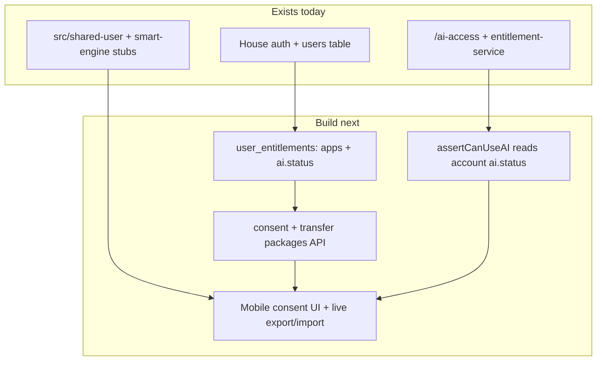

# Shared User + Smart Engine — Implementation Plan

> **Date**: Jul 2026  
> **Depends on**: [Shared_User_Smart_Engine_Research.md](./Shared_User_Smart_Engine_Research.md) (v1.1)  
> **Related**: [Brand_Token_Ecosystem_Plan.md](./Brand_Token_Ecosystem_Plan.md)  
> **Canonical ready-to-implement plan (v1.4)**: [Ecosystem_Data_Bridge_Plan.md](./Ecosystem_Data_Bridge_Plan.md) — identity registry, Soft Transfer protocol, Life Snapshot, secrets, rollback

---

## Verdict

**Not fully implemented.** Research is locked; mobile has thin stubs only. Brand white-label work does **not** replace this.

| Layer | Today | Target |
|---|---|---|
| Shared User | House auth + `users` table | Entitlements + `/shared-user/me` claims |
| AI | House `/ai-access` + `entitlement-service` | Account `ai.status` gates all brands |
| Transfer | `src/smart-engine/transfer.ts` no-ops | Consent API + live packages |
| Gateway | `assertCanUseAI` (paid/BYOK) | Also reject when `ai.status === off` |

**Scope of this plan:** Phases **A + B + C** with **House↔Budget** as the first real transfer path.  
**Out of scope:** Language/Health ports, BYOK vault, separate Cloudflare Worker deploy.

---

## Phase A — Shared User spine (backend)

**Goal:** one `user_id` + entitlement claims usable by every brand build.

1. New D1 migration (immutable once applied):
   - `user_entitlements` — `user_id`, `ai_status` (`off` | `trial` | `on`), `ai_mode` (`platform` | `byok`), `updated_at`
   - `user_app_entitlements` — `user_id`, `brand_id`, `status` (`entitled` | `revoked`)
2. `backend/src/services/shared-user-service.ts` — read/upsert; defaults: `ai_status=off`, existing users entitled to `simple-house` (+ `simple-budget` when that brand ships).
3. Extend JWT and/or add `GET /shared-user/me` → `{ user_id, apps[], ai: { status, mode } }`.
4. Keep one Worker; nest under `/shared-user/*` (no second deploy yet).
5. Mobile: map server payload into `SharedUserProfile` in `src/shared-user/`; prefer server `ai.status` over flag-only derivation.

---

## Phase B — AI entitlement (fleet)

**Goal:** account `ai.status` is source of truth; core works with AI off.

1. Evolve `backend/src/services/entitlement-service.ts`: `assertCanUseAI` requires `ai_status !== 'off'` **and** existing paid/BYOK rules.
2. Settings master switch: `PATCH /shared-user/ai` → `off` | `on`; when `off`, skip AI jobs (outbound housekeeper loop already calls `assertCanUseAI`).
3. `AIAccessGate` uses server `accountAiStatus`; acceptance: House + Budget usable with AI off.
4. Billing: RevenueCat/Stripe → `ai_status` can stay v2; v1 = Settings + paid-sub mapping.

---

## Phase C — Transfer + consent (House↔Budget)

**Goal:** export/import packages with consent; no cross-product table joins.

1. Schema: `transfer_consents`, `transfer_package_events`.
2. Routes under `/smart-engine/`:
   - `POST /consents` / `DELETE /consents/:id`
   - `POST /packages/:packageId/export`
   - `POST /packages/:packageId/import`
3. v1 packages:
   - `profile.core.v1`
   - `house.property.v1` (House → Budget)
   - `budget.summary.v1` (Budget → House glance)
   - `ai.memory.v1` only when `ai_status !== 'off'`
4. Replace stubs in `src/smart-engine/transfer.ts` with API client; Settings consent sheet + Budget import CTA.
5. Hard rule: product services never query another product’s tables.

---

## Suggested PR order

1. Migration + `shared-user-service` + `/shared-user/me`
2. Wire `assertCanUseAI` + mobile `accountAiStatus` from server
3. Consent + transfer tables/routes + `profile.core.v1`
4. `house.property.v1` / `budget.summary.v1` + mobile UI
5. Mark research Phases A–C ✅ when E2E passes

---

## Verification

- Same account opens House + Budget builds (`APP_BRAND` differs; same `user_id`)
- AI off: no model calls; CRUD/sync/Widget basics still work
- AI on: gates unlock; flipping off mid-session rejects new AI calls
- House→Budget `house.property.v1` only after consent; revoke blocks re-export
- Worker tests for new services; Maestro smoke for AI-off path

---

## Todos

| ID | Task |
|---|---|
| su-a-schema | D1 entitlements + `shared-user-service` + `/shared-user/me` |
| su-b-ai | `assertCanUseAI` + Settings AI switch + mobile from server |
| su-c-consent | Consent + transfer schema/routes + `profile.core.v1` |
| su-c-packages | `house.property.v1` + `budget.summary.v1` + mobile UI |
| su-verify | E2E acceptance + update research status A–C |
