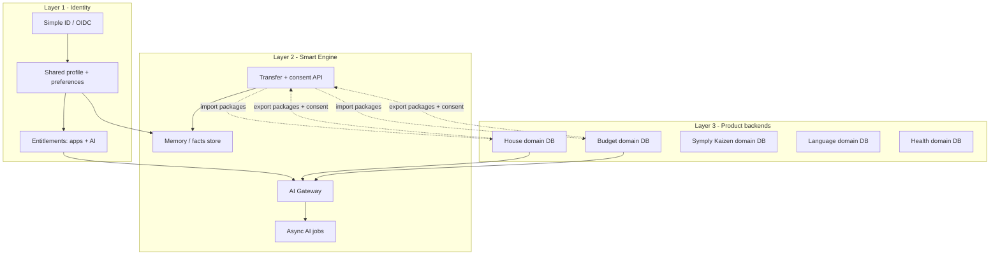

# Shared User + Smart Engine — Research & Architecture Recommendation

> **Status**: Research v1.1 (Jul 2026) — architecture locked; **implementation = partial stubs only**  
> **Applies to**: Simple ✦ fleet (House, Budget, Symply Kaizen, Language, Health, …)  
> **Related**: [Brand_Token_Ecosystem_Plan.md](./Brand_Token_Ecosystem_Plan.md) · [WHITELABEL_TEMPLATE.md](./WHITELABEL_TEMPLATE.md)

---

## Implementation status (Jul 2026)

**Verdict: not fully implemented.** White-label / brand packs advanced; Shared User + Smart Engine remain mostly research + thin mobile stubs. Backend still uses House-centric auth + `/ai-access` (not a fleet Shared User service).

| Research deliverable | Status | Where |
|---|---|---|
| **A — Shared User spine** (canonical `user_id`, entitlements, SSO across brands) | **Not started** (backend) | Auth is still House Worker; brands share code but not a dedicated Simple ID service |
| **B — AI entitlement** ecosystem `ai.status` | **Partial** | Mobile: `src/shared-user/`, `accountAiStatus` on `useAIEntitlement` / `AIAccessGate`. Backend: existing `entitlement-service` + `/ai-access` (House-scoped, not fleet claims) |
| **C — Transfer + consent API** | **Stub only** | `src/smart-engine/transfer.ts` — catalog + no-op export/import; **no** Worker routes / D1 tables |
| **D — Cross-app AI gateway / meters** | **Not started** | Apps still hit House AI providers; no shared fleet gateway AuthZ beyond existing `assertCanUseAI` |
| **E — Health-grade controls** | **Not started** | Wait for Health brand |

**Do we implement it next?** Yes — as a dedicated backend + mobile wiring track. Brand-token work does **not** replace this.

**Implementation plan (brief):** [Shared_User_Smart_Engine_Implementation_Plan.md](./Shared_User_Smart_Engine_Implementation_Plan.md) (Phases A–C, House↔Budget first).  
**Canonical ready-to-implement plan (v1.4):** [Ecosystem_Data_Bridge_Plan.md](./Ecosystem_Data_Bridge_Plan.md) — identity registry, cross-Worker Soft Transfer, Life Snapshot.

Mobile stubs to evolve (do not throw away):

- [`src/shared-user/index.ts`](../../src/shared-user/index.ts)
- [`src/smart-engine/transfer.ts`](../../src/smart-engine/transfer.ts)
- [`src/hooks/useAIEntitlement.ts`](../../src/hooks/useAIEntitlement.ts)
- [`src/components/ai/AIAccessGate.tsx`](../../src/components/ai/AIAccessGate.tsx)

---

## Problem statement

Build a **shared User + Smart Engine service** used by all ecosystem apps so that:

1. One person has **one identity** across Simple House, Simple Budget, Symply Kaizen, Language, Health, …
2. Selected **user data can transfer** across apps (with consent), without merging product databases
3. Apps use **AI heavily when enabled**, but **core product works fully without AI**
4. Enabling AI is a **user/account entitlement** that unlocks AI capabilities **across the apps they use** (not a per-screen hack)

---

## Competitor / platform analysis

| Player | What they share | How data crosses products | AI model | Lessons for Simple ✦ |
|---|---|---|---|---|
| **Intuit** (TurboTax, Credit Karma, QuickBooks, Mailchimp) | Platform identity + consented data bridge | Explicit link + consent; data mesh / data products; bi-directional federation SSO when IdPs differ | AI as platform capability layered on product data | **Identity ≠ data access.** Share via bridge + consent, not shared tables. |
| **Adobe Creative Cloud** | Adobe ID + entitlements | Cloud docs / libraries; apps are clients of shared services | Generative credits / Firefly as **add-on entitlement** | Separate **app entitlement** from **AI credit entitlement**. |
| **Microsoft Graph** | Entra identity + activity feed | Publish activities; resume across devices | Copilot often licensed separately | Shared **activity / resume** graph ≠ dumping all app data into one DB. |
| **Apple Continuity / Handoff** | Apple ID | Small activity payloads; large sync via iCloud | On-device vs Apple Intelligence (optional) | Transfer **intent + IDs**, not whole databases. |
| **Notion** | Workspace identity | Single product surface | **Notion AI = optional add-on**; core docs work without AI; privacy / no training by default | Closest UX match: **core app valuable without AI; AI is a toggleable paid layer**. |
| **Duolingo Max / Grammarly Go** | Account + subscription | Single app (or suite) | AI tier on top of free/paid base | AI as **tier**, not the product itself. |
| **Scalekit / OIDC multi-app auth** | Environment-level session | Each app = OAuth client; shared session, per-app tokens | N/A | **One IdP session, many client_ids** (House, Budget, …). |
| **Multi-product SaaS practice** ([Veld](https://veldsystems.com/blog/multi-product-saas-architecture)) | `common.users` owns identity | Schema isolation; products never join each other’s tables | Entitlement-based feature gating | Shared identity schema + per-product data + entitlements table. |

### Patterns that fail

| Anti-pattern | Why it hurts |
|---|---|
| One mega-database all apps read/write | Coupling, privacy blowups, impossible to ship Health later |
| “Shared login” without shared `user_id` | Duplicate accounts; no transfer |
| Silent cross-app data copy | GDPR/CCPA consent drift; trust collapse |
| AI required for core flows | Offline / privacy / cost / App Review risk; users who refuse AI churn |
| Per-screen AI paywalls only | Inconsistent UX; hard to sell “AI for the ecosystem” |

---

## Best-practice architecture (recommended)

Three layers. Do not collapse them.



### Layer 1 — Shared User (Simple ID)

**Owns:** authentication, stable `user_id`, profile (name, avatar, locale, timezone), device list, **which apps** the user may open, **AI entitlement** (off / trial / on / BYOK), ecosystem consent registry.

**Does not own:** tasks, budgets, lessons, health records, floor plans.

**Auth model (best practice):**
- One identity authority (OIDC-compatible)
- Each mobile app brand = **separate OAuth client** (bundle ID) with its own tokens
- Shared **environment session** where possible (SSO across Simple apps)
- JWT / session claims include: `user_id`, `app_ids[]`, `ai_tier`, `scopes`

Aligns with Scalekit-style multi-app auth and Intuit’s “identity above products.”

### Layer 2 — Smart Engine

**Owns:**
1. **Memory** — user-approved facts usable across apps (e.g. household size, language goals, currency) — not raw product tables
2. **Transfer** — explicit, versioned **data packages** between apps (`budget.summary.v1`, `house.property.v1`) with consent purpose + expiry
3. **AI Gateway** — single place for model routing, rate limits, cost, PII policy, audit; used by all apps when AI is on
4. **Job orchestration** — long-running AI (report OCR, imports) already similar to House JobManager / Lambda

**Does not own:** product UX or product-of-record storage.

**Transfer rules (best practice):**
- Apps **publish** export packages; they never `SELECT` another app’s tables
- Consumer apps **import** into their own schema
- Every transfer requires **purpose-scoped consent** (identity graph / CDP lesson: consent travels with the data or activation is illegal)
- Prefer event-driven sync (CDC / queue) over brittle nightly copies (Intuit “data bridge” lesson)

### Layer 3 — Product backends

Keep **House / Budget / Health** domain data isolated (separate D1 bindings or schemas). Shared services reference `user_id` only.

Matches Veld: products reference `common.users`, never each other’s schemas.

---

## AI: optional, ecosystem-wide, core works without it

### Product principle (non-negotiable)

| Mode | Behavior |
|---|---|
| **AI off (default until purchased/enabled)** | Full CRUD, sync, notifications, Widget/Watch basics, manual flows. No AI entry points, no background AI jobs, no model calls. |
| **AI on** | Same app + Smart Engine AI Gateway; Mira / imports / OCR / coaching / suggestions appear across entitled apps. |

This matches **Notion AI add-on**, **Grammarly Go / Duolingo Max** tiering, and open-source patterns that gate AI behind a global switch (hide surfaces + stop background requests).

### SimpleHouse today (already partial)

House already has `AIAccessGate` / `useRequireAIAccess` / AI Access screens. **Evolve this into an ecosystem entitlement**, not delete it:

- Today: often per-feature gates inside House  
- Target: **one account-level `ai_enabled` (+ tier)** checked by every brand; gates become thin UI wrappers around the entitlement

### Entitlement model

```ts
// Conceptual — lives on Shared User / billing, not per brand pack
type EcosystemEntitlements = {
  apps: Array<'simple-house' | 'simple-budget' | 'kaizen' | 'simple-language' | 'simple-health'>;
  ai: {
    status: 'off' | 'trial' | 'on';
    // Optional later: provider keys via vault / virtual keys (BYOK)
    mode: 'platform' | 'byok';
    scopes: Array<'chat' | 'import' | 'vision' | 'coach'>; // optional fine grain
  };
};
```

**Billing recommendation:** entitlement table is source of truth (RevenueCat / Stripe webhooks update it). Apps never hard-code plan names in feature checks — they check `canUseAI`, `canOpenApp('simple-budget')`.

### AI Gateway (Smart Engine)

When AI is on, all apps call **one gateway** (Worker service):

- AuthZ: reject if `ai.status === 'off'`
- Route to Anthropic / Gemini / etc. (House already has provider abstraction)
- Token budgets, rate limits, audit logs
- PII redaction policy (especially Health later)
- Optional later: BYOK via vault + virtual keys (enterprise pattern — do not build day one)

Microsoft / Maxim / BYOK literature: gateway is a **re-architecture**, not a toggle — plan the boundary early even if v1 only supports platform keys.

### UX rules

1. Core paths never call the gateway.
2. AI surfaces are **enhancements** (suggest, import, summarize) with manual fallback.
3. Master switch: Settings → AI — off hides chrome and cancels pending AI jobs.
4. Enabling AI once applies to **all apps on the account** that opt into the ecosystem AI product (configurable: global vs per-app — recommend **global for v1** to match “entire app / ecosystem” ask).
5. Privacy copy: no training on user data by default (Notion-style contractual posture).

---

## What data should transfer (v1 catalog)

Start tiny. Expand with consent.

| Package ID | Source → sink | Contents (examples) | Needs AI? |
|---|---|---|---|
| `profile.core.v1` | ID → all apps | name, locale, timezone, avatar | No |
| `prefs.notifications.v1` | ID → all apps | quiet hours, channels | No |
| `house.property.v1` | House → Budget | address city, property type (non-sensitive summary) | No |
| `budget.summary.v1` | Budget → House | monthly spend snapshot for Home glance | No |
| `goals.life.v1` | Symply Kaizen → Language | learning goals | No |
| `ai.memory.v1` | Smart Engine → apps | user-approved memory facts | Only written when AI on |

Health packages require stricter consent and should wait until Health rewrite.

---

## Phased delivery (fits fleet plan)

| Phase | Deliverable |
|---|---|
| **A — Shared User spine** | Canonical `user_id` across brand apps; entitlement claims; SSO story (same account in House + Budget) |
| **B — AI entitlement** | Elevate `AIAccessGate` to ecosystem `ai.status`; core paths AI-free verified; gateway rejects when off |
| **C — Smart Engine memory + transfer** | Consent API + 2–3 packages (profile + House↔Budget summary) |
| **D — Cross-app AI** | Same Mira/gateway persona policies per brand; shared usage meters |
| **E — Health-grade controls** | Purpose limitation, export filters, stricter gateway policies |

Order relative to fleet: **A+B before or with Simple Budget extract** (Budget is the first second-app that needs shared login + AI entitlement). Transfer packages (**C**) land as Budget + House both ship.

---

## Recommendations (decisions)

| Decision | Recommendation |
|---|---|
| Who owns the user? | **Shared User / Simple ID service** — not House, not Budget |
| Cross-app data | **Export/import packages + consent** — never shared product tables |
| Smart Engine | Separate Worker (or Worker module) for memory, transfer, AI gateway, jobs |
| AI default | **Off** until user enables / purchases |
| AI scope | **Account-level** entitlement unlocks AI in all entitled apps (v1) |
| Core without AI | Mandatory acceptance test per brand |
| BYOK | Phase later; design gateway so keys are not hardcoded in apps |
| Cursor / repos | Still one RN platform; Shared User + Smart Engine live in `backend/` (or `backend/services/identity` + `smart-engine`) |

---

## Success criteria

- User signs into Simple Budget with the same account as Simple House without re-creating profile
- Turning AI **off** removes AI UI and stops model/job traffic; House and Budget remain fully usable
- Turning AI **on** once enables AI gates across entitled apps
- House→Budget transfer of an approved package works only after consent; revoke stops future sync
- No product service queries another product’s database

---

## Sources (selected)

- [Multi Product SaaS Architecture — Veld Systems](https://veldsystems.com/blog/multi-product-saas-architecture)
- [Scalekit Multi-App Authentication](https://www.scalekit.com/blog/introducing-multi-app-authentication)
- [Intuit platform architecture / data bridge](https://www.intuit.com/company/press-room/press-releases/2022/intuits-global-financial-technology-platform-architecture-drives-technology-innovation-for-customers-with-speed-at-scale/)
- [Intuit bi-directional federation SSO patent](https://patents.google.com/patent/US11831633B1/en)
- [Microsoft Graph cross-device experiences](https://learn.microsoft.com/en-us/graph/cross-device-concept-overview)
- [Apple Handoff](https://developer.apple.com/documentation/foundation/implementing-handoff-in-your-app)
- [Notion AI security & privacy](https://www.notion.com/help/notion-ai-security-practices)
- [Microsoft GenAI gateway playbook](https://learn.microsoft.com/en-us/ai/playbook/solutions/genai-gateway/)
- [BYOK AI architecture patterns](https://osfoundry.io/articles/byok-architecture-patterns-for-llms)
- Identity graph / consent: [consent drift in CDP pipelines](https://www.pathtoproject.com/blog/20241008-consent-drift-in-cdp-event-pipelines)
